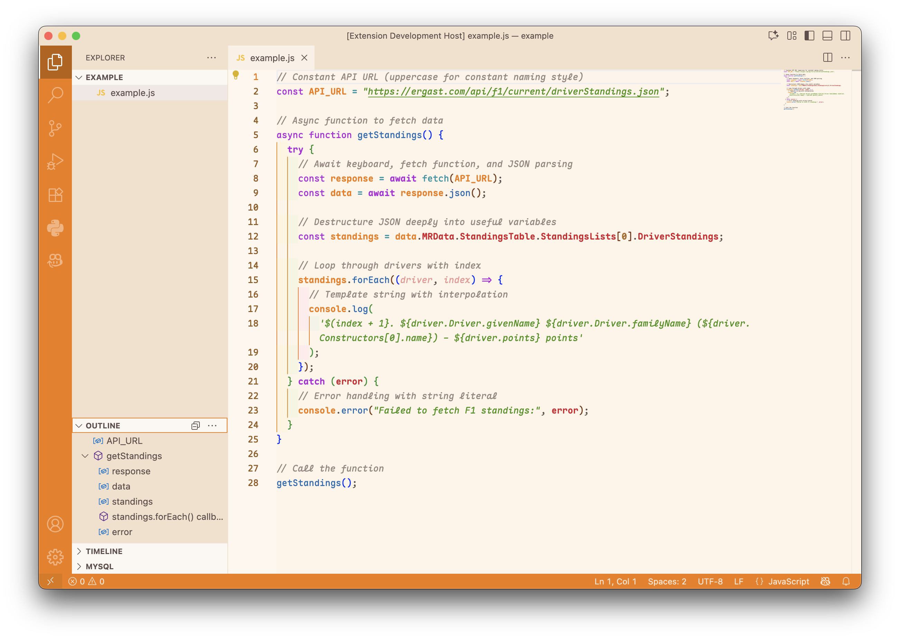

# Smooth Operator

A custom theme that I made because I wanted something orange-ish and easy on the eyes.

There's a Formula 1 outline in the icon because the name of this extension is inspired by Carlos Sainz, the **Smooth Operator**.

### Light screenshot

### Dark screenshot

## For more information

* [Visual Studio Code's Markdown Support](http://code.visualstudio.com/docs/languages/markdown)
* [Markdown Syntax Reference](https://help.github.com/articles/markdown-basics/)

**Enjoy!**
